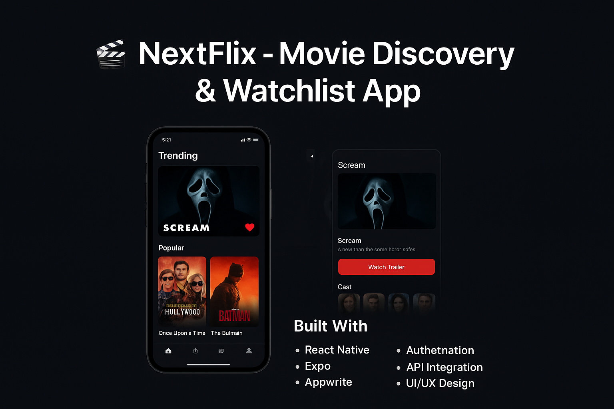

# 🎬 NextFlix - Movie Discovery & Watchlist App



**NextFlix** is a movie discovery app built with **React Native** and **Expo** that allows users to:

- 📈 Browse trending movies  
- 🎥 View detailed movie information & watch trailers  
- 📌 Save and manage a personalized watchlist  
- 🔐 Securely sign in and store favorites with **Appwrite**  

---

## 🚀 Features
- **Trending Movies** – Stay updated with what's popular right now.  
- **Detailed Movie Pages** – View cast, synopsis, release date, and more.  
- **Trailer Support** – Watch trailers directly in-app.  
- **Personal Watchlist** – Add/remove movies securely using **Appwrite Authentication**.  
- **Cross-Platform** – Runs smoothly on both iOS and Android with **Expo Router**.  

---

## 🛠️ Tech Stack
- **React Native** & **Expo** – Cross-platform mobile development  
- **Appwrite** – Authentication & database storage  
- **TMDB API** – Movie data & trailers  
- **NativeWind** – Styling and responsive UI  
- **Expo Router** – Navigation  

---

## 📚 What I Learned
- Integrating **third-party APIs** (TMDB) for real-time movie data  
- Managing authentication and database storage with **Appwrite**  
- Designing scalable and responsive mobile UIs with **NativeWind**  
- Structuring navigation with **Expo Router** for a smooth user experience  

---

## 📦 Installation

```bash
# Clone the repository
git clone https://github.com/pranavsaigandikota/NextFlix.git

# Navigate into the project folder
cd NextFlix

# Install dependencies
npm install

# Start the development server
npx expo start
